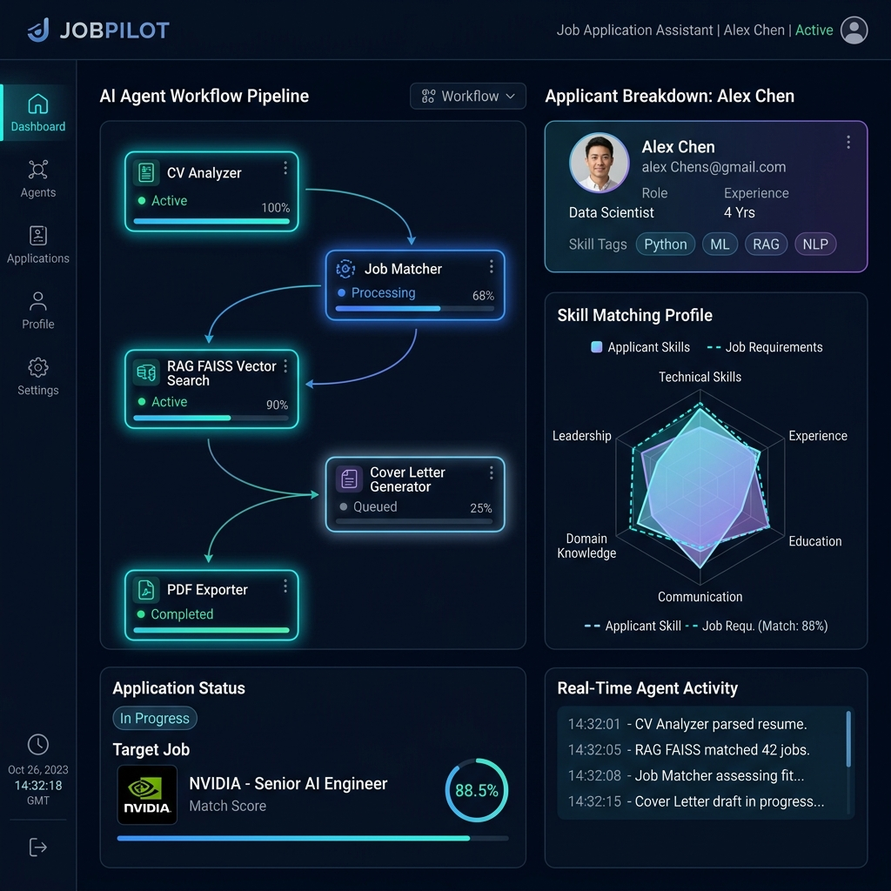

# 🚀 JobPilot — Multi-Agent AI Job Application Assistant

[](https://www.python.org/)
[](https://huggingface.co/)
[](https://pytorch.org/)
[](https://github.com/facebookresearch/faiss)
[](https://gradio.app/)
[](LICENSE)

> **JobPilot** is an end-to-end, multi-agent AI system powered by **Hugging Face LLMs**, **Sentence Transformers**, and a **FAISS RAG Vector Store**. It automates candidate resume analysis, job requirement extraction, similarity matching, cover letter writing, interview preparation, quality audit verification, and PDF report generation.

---

## 📸 Preview



---

## ✨ Key Features

- 📄 **Automated PDF & Text Parsing**: Parses candidate CVs and target job descriptions effortlessly using `PyPDF` and Regex normalizers.
- 🤖 **6 Autonomous Specialized Agents**:
  - **CV Agent**: Extracts candidate skills, work history, education, and achievements while feeding chunks into the RAG vector store.
  - **Job Agent**: Extracts core responsibilities, key technical qualifications, soft skills, and role requirements.
  - **Matching Agent**: Performs 0–100% fit analysis, identifies matching strengths, skill gaps, and retrieves RAG evidence.
  - **Application Agent**: Crafts personalized cover letters and structured responses for standard application questions.
  - **Interview Agent**: Formulates technical deep-dive questions and behavioral STAR prep guides.
  - **Quality Agent**: Performs strict anti-hallucination audits, cross-referencing generated content with RAG ground truth.
- ⚡ **RAG Engine with FAISS**: Utilizes `sentence-transformers/all-MiniLM-L6-v2` and `FAISS` vector indexing to retrieve factual evidence from the candidate's CV.
- 📊 **Executive PDF Report Export**: Uses `ReportLab` to build a clean multi-page PDF application package containing all agent insights and scorecards.
- 💻 **Interactive Gradio Web Application**: Modern tabbed interface with real-time execution feedback and direct PDF downloading.

---

## 🏗️ System Architecture

```
                       ┌─────────────────────────┐
                       │   CV & Job Description  │
                       │   (PDF / Text Input)    │
                       └────────────┬────────────┘
                                    │
           ┌────────────────────────┴────────────────────────┐
           ▼                                                 ▼
  ┌─────────────────┐                               ┌─────────────────┐
  │  Agent 1: CV    │                               │  Agent 2: Job   │
  │  (Parsing + RAG)│                               │  (Requirements) │
  └────────┬────────┘                               └────────┬────────┘
           │                                                 │
           ▼                                                 │
  ┌─────────────────┐                                        │
  │  FAISS Vector   │                                        │
  │  Store Indexing │                                        │
  └────────┬────────┘                                        │
           │                                                 │
           └────────────────────────┬────────────────────────┘
                                    ▼
                         ┌────────────────────┐
                         │ Agent 3: Matching  │
                         │ (Fit Analysis % )  │
                         └──────────┬─────────┘
                                    │
           ┌────────────────────────┼────────────────────────┐
           ▼                                                 ▼
  ┌─────────────────┐                               ┌─────────────────┐
  │ Agent 4: App    │                               │ Agent 5: Prep   │
  │ (Cover + Q&A)   │                               │ (Interview)     │
  └────────┬────────┘                               └────────┴────────┘
           │
           ▼
  ┌─────────────────┐
  │ Agent 6: Audit  │ ──► Anti-Hallucination RAG Grounding
  │ (Verification)  │
  └────────┬────────┘
           │
           ▼
  ┌─────────────────┐
  │ PDF Generator   │ ──► Executive Application Package (.pdf)
  │  (ReportLab)    │
  └─────────────────┘
```

---

## 🤖 Multi-Agent Breakdown

| Agent | Module | Role & Operations |
| :--- | :--- | :--- |
| **1. CV Agent** | `CVAgent` | Parses CV text, identifies key profile attributes, and indexes vector embeddings into FAISS. |
| **2. Job Agent** | `JobAgent` | Analyzes job postings to extract critical technical skills, experience prerequisites, and duties. |
| **3. Matching Agent** | `MatchingAgent` | Queries FAISS vector store for evidence, computes candidate match score (0-100%), and detects skill gaps. |
| **4. Application Agent** | `ApplicationAgent` | Writes tailored cover letters and constructs factual responses to common application prompts. |
| **5. Interview Agent** | `InterviewAgent` | Builds tailored interview preparation kits, technical deep-dive questions, and STAR answer templates. |
| **6. Quality Agent** | `QualityAgent` | Audits generated text against RAG ground truth to ensure zero unsupported claims or hallucinations. |

---

## 🛠️ Technology Stack

| Domain | Framework / Library |
| :--- | :--- |
| **Language** | Python 3.10+ |
| **LLMs & Pipelines** | Hugging Face `transformers` (`Qwen/Qwen2.5-7B-Instruct`), PyTorch |
| **Embeddings** | `sentence-transformers/all-MiniLM-L6-v2` |
| **Vector DB** | `FAISS` (Facebook AI Similarity Search) |
| **Text Chunking** | LangChain `RecursiveCharacterTextSplitter` |
| **PDF Extraction** | `pypdf` |
| **PDF Generation** | `ReportLab` |
| **Web Interface** | `Gradio` |

---

## 🚀 Quickstart & Setup

### Prerequisites

Ensure you have Python 3.10+ and CUDA-enabled PyTorch (optional, CPU fallback supported).

```bash
# Clone the repository
git clone https://github.com/Refaat-1/JobPilot.git
cd JobPilot
```

### Installation

Install required Python dependencies:

```bash
pip install transformers sentence-transformers faiss-cpu pypdf reportlab gradio langchain-text-splitters accelerate torch pandas numpy
```

### Running the Application

Launch the full interactive Gradio web app or open the notebook:

```bash
# Launch via Jupyter Notebook
jupyter notebook "jobpilot-final_project (1).ipynb"
```

Or run directly inside Google Colab / Kaggle GPU environments.

---

## 🛡️ Anti-Hallucination Quality Verification

JobPilot incorporates a **Quality Audit Engine** (`QualityAgent`) that operates on RAG evidence:
- Retrieves exact text chunks from the candidate's CV stored in the FAISS index.
- Cross-checks all generated cover letter statements and application answers.
- Assigns a **Verification Audit Score (%)** and highlights any unverified or exaggerated claims before finalizing the application package.

---

## 📄 License

Distributed under the MIT License. See [`LICENSE`](LICENSE) for details.